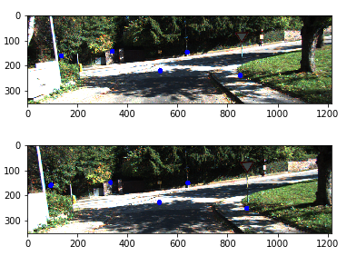
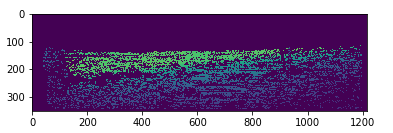

# Depth Completion for Low-res Lidar

## Project Pipeline

Markup :* Find relative pose between different frames using Perspective-n-Point algorithm

	* Use the above result to transform 3D points to the last co-ordinate frame and project it back to obtain the concatenated depth image (for benchmarking results)
Concatenated Depth image : 

Ground Truth Depth image : 

	* Form superpixels using Simple Linear Iterative Clustering from pairs of RGB images and match them by comparing the mean depth value of the superpixels
Superpixels :

Superpixel matche across 2 frames : 

	* Reject lidar depth points from superpixel matches whose depth difference is larger than a threshold parameter, and concatenate remaining depth points
Concatenated Depth image after Outlier rejection : 

