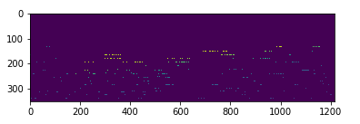
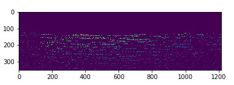
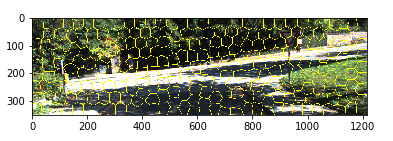
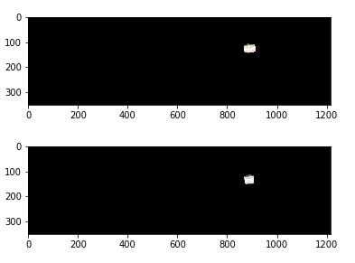
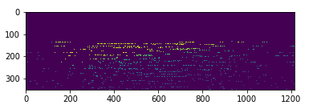

# Depth Completion from Low-res LiDAR and monocular camera

 - This project focusses on utilising temporal visual information to build denser concatenated depth images comparable to the data from a 64-line LiDAR to serve as an input to the [Self-supervised Depth completion network proposed here](https://github.com/fangchangma/self-supervised-depth-completion). 

 - A novel outlier rejection algorithm involving superpixel matching has been implemented to improve the RMSE metric of the concatenated depth image.

 - The sparse depth images representing data from a 16-line LiDAR has been created by downsampling the images in the [KITTI Depth completion dataset](http://www.cvlibs.net/datasets/kitti/eval_depth.php?benchmark=depth_completion) which hosts data from a 64-line LiDAR. 

## Project Pipeline

 - Determine the relative pose between consecutive frames using Perspective-n-Point algorithm. <br />
 - Use the above result to transform the depth image points from consecutive frames to the last frame in the batch. A batch size of 5 has been used in the experiment. <br />
**Sparse input Depth image** <br />
 <br />
**Concatenated Depth image from 5 consecutive frames** <br />
 <br />
 - Form superpixels using [Simple Linear Iterative Clustering](http://www.cs.jhu.edu/~ayuille/JHUcourses/VisionAsBayesianInference2020/4/s/Achanta_SLIC_PAMI2012.pdf) (SLIC) in the RGB images and match them across consecutive frames using the distance between their cluster centres (weighted sum of distance in CIELAB color space and euclidean distance in pixels) <br />
**Superpixels**: <br />
 <br />
**Matched superpixels example** <br />
 <br />
 - Reject lidar depth points from superpixel matches by thresholding their **mean depth** difference. Concatenate the remaining depth points to form the depth image input to the neural network. As can be seen in [Depth Completion.ipynb](./Project/Depth_completion.ipynb), our method results in an increase in the number of valid points in the final depth image with a significant improvement in the RMSE metric. <br />
**Concatenated Depth image after Outlier rejection** <br />


## Dependencies  
```
OpenCV
numpy
scipy
scikit-image
matplotlib 
math
PIL 
system 
date_time
```

### Code structure

1. [Depth Completion.ipynb](./Project/Depth_completion.ipynb) contains the main executable code
2. [data_read_depthCompletion.py](./Project/data_read_depthCompletion.py) contains the Data_load class for the downsampled dataset.
3. [helper_depthCompletion.py](./Project/helper_depthCompletion.py) contains the utility functions for the relative pose estimation and concatenation modules.
4. [slic.py](./Project/slic.py) contains the class definitions of SuperPixels & Cluster classes which are used for superpixel generation and matching.
